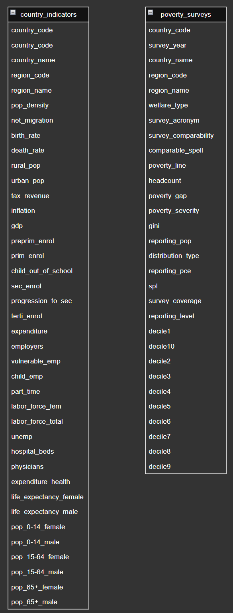

# Projeto de Banco de Dados: Pobreza, Desigualdade e Indicadores Sociais Globais em DuckDB

## Descrição do Projeto

Este projeto integra dados de dois conjuntos de dados (datasets) relacionados a:
- [Pobreza e desigualdade global](https://pip.worldbank.org/poverty-calculator)
- [Indicadores de educação, trabalho, demografia, saúde e economia dos países](https://datacatalog.worldbank.org/search/dataset/0037712/World-Development-Indicators)

O banco de dados foi desenvolvido para armazenar, organizar e permitir consultas significativas sobre a situação social e econômica dos países, com foco em temas diretamente conectados aos **Objetivos de Desenvolvimento Sustentável (ODS)** da ONU.

---

## Objetivos de Desenvolvimento Sustentável Relacionados
Os dados e consultas abordam temas conectados aos seguintes ODS:
- ODS 1: Erradicação da Pobreza
- ODS 3: Saúde e Bem-Estar
- ODS 4: Educação de Qualidade
- ODS 10: Redução das Desigualdades  

---

## 1. Justificativa para a escolha do DuckDB para o cenário atribuído à sua equipe.   

Nosso grupo pegou o cenário A do projeto 2. Neste cenário era pedido uma abordagem para realizar análises em grandes volumes de dados imutáveis, em que as consultas acessam um número pequenos de atributos que possuem grande volume de registros.  
Esses dados sendo imutáveis e históricos, por sua vez, são submetidos a baixa frequência de escrita ou atualização, porém grande frequência de leitura que devem ser confiáveis.

Diante dessas características, optamos pelo uso do **DuckDB**, um sistema de gerenciamento de banco de dados analítico **in-process**, leve, moderno e altamente eficiente para análises locais. A seguir, discutimos essa escolha sob os aspectos de **armazenamento**, **linguagem e processamento de consultas**, **controle de transações**, **mecanismos de recuperação** e **segurança**.

### 🔹 Forma de Armazenamento de Arquivos

O DuckDB utiliza um modelo **colunar** de armazenamento, o que o torna ideal para workloads analíticos onde apenas algumas colunas de muitos registros são lidas em cada consulta. Ele pode trabalhar com seu próprio formato binário local (arquivos `.duckdb`) e também **acessar diretamente arquivos no formato Parquet**, sem necessidade de importação. Esse formato colunar permite compressão eficiente e acelera operações de agregação e filtragem — exatamente o tipo de operação predominante no cenário proposto.

Além disso, por ser **in-process**, o DuckDB pode operar diretamente dentro de um script Python ou R, mantendo os dados em memória quando necessário, e evitando a sobrecarga de uma arquitetura cliente-servidor.

### 🔹 Linguagem e Processamento de Consultas

O DuckDB utiliza **SQL padrão ANSI**, oferecendo uma linguagem expressiva e poderosa para realizar consultas complexas, agregações, joins e filtros. O motor de execução é **vetorizado**, ou seja, processa blocos de dados em lotes (em vez de linha a linha), o que proporciona altíssimo desempenho, principalmente em operações analíticas típicas de Data Science e BI.

Além disso, há integração nativa com estruturas como **DataFrames do Pandas** e bibliotecas como `pyarrow`, `numpy` e `dplyr` no R. Isso facilita o uso por analistas de dados que já trabalham com notebooks Jupyter ou RStudio, permitindo uma curva de aprendizado mínima e grande produtividade.

### 🔹 Processamento e Controle de Transações

Embora o foco principal do DuckDB seja leitura e análise, ele implementa um modelo transacional baseado no conceito de **ACID**. Para garantir consistência e integridade em operações de escrita (ainda que raras neste cenário), o DuckDB aplica o modelo **MVCC (Multi-Version Concurrency Control)**, permitindo transações simultâneas com isolamento apropriado.

No contexto do cenário A, onde a escrita é rara e controlada, o modelo de transações do DuckDB é mais do que suficiente para garantir **consistência eventual** e confiabilidade nas leituras, sem a complexidade e sobrecarga de sistemas OLTP tradicionais.

### 🔹 Mecanismos de Recuperação

O DuckDB implementa **checkpointing e write-ahead logging (WAL)**, que são mecanismos fundamentais para garantir a durabilidade das operações. Mesmo que a frequência de escrita seja baixa, esses mecanismos asseguram que qualquer escrita realizada possa ser recuperada corretamente em caso de falhas.

Os checkpoints permitem que o banco persista o estado do banco de tempos em tempos, enquanto o WAL garante que todas as alterações sejam registradas antes de serem aplicadas ao banco — respeitando a propriedade de durabilidade do modelo ACID. Isso traz segurança mesmo para dados que são eventualmente atualizados.

### 🔹 Segurança

Como o DuckDB opera tipicamente em modo local, embutido dentro de aplicações ou notebooks, o modelo de segurança se foca mais em **controle de acesso ao arquivo** e boas práticas de isolamento no sistema operacional. Ele **não é projetado para múltiplos usuários concorrentes via rede**, como bancos de dados cliente-servidor (e isso está de acordo com os requisitos do cenário, onde isso não é exigido).

Entretanto, por operar em arquivos locais, ele pode se integrar facilmente a mecanismos externos de criptografia de disco, controle de permissões por sistema de arquivos, versionamento via Git ou backups em nuvem — estratégias que já fazem parte do workflow típico de cientistas de dados.

## 2. Modelo **lógico**

Para atender ao cenário A — que envolve grandes volumes de dados históricos, imutáveis e voltados à análise — adotamos um modelo relacional tradicional, estruturado em tabelas, o que é compatível com o DuckDB.

Com base no pré-processamento realizado a partir do banco normalizado, o novo banco de dados no formato adequado ao DuckDB foi estruturado com duas tabelas principais: country_indicators e poverty_surveys, que foram geradas pelo programa [duck_entities](processing/duck_entities.py). De forma a juntar entidades fracas e reduzir o número de "join" das consultas normalizadas.

### [Tabela 1: country_indicators](duckdb_ready_data/country_indicators.csv)

Agrupa todos os indicadores globais por país e ano. Representa dados agregados de demografia, economia, educação, emprego, saúde, expectativa de vida e população.

Principais colunas:
year: ano da observação (PK parcial)
country_code: código ISO do país (PK parcial)
country_name: nome do país
region_code: código da região geográfica
region_name: nome da região
life_expectancy_female, life_expectancy_male: expectativa de vida por gênero
pop_0-14_female, pop_0-14_male, ..., pop_65+_female, etc: colunas pivotadas da população por idade e gênero
education_index, health_expenditure, gdp_per_capita, employment_rate, etc.

Relacionamento com a tabela poverty_surveys via `country_code`.

### [Tabela 2: poverty_surveys](duckdb_ready_data/poverty_surveys.csv)

Contém dados de pesquisas de pobreza/desigualdade com distribuição de renda por decil e metadados da coleta.

Principais colunas:
country_code: código do país (PK parcial)
survey_year: ano da pesquisa (PK parcial)
survey_acronym: sigla da pesquisa (PK parcial)
survey_coverage: abrangência (PK parcial)
reporting_level: nível de agregação dos dados (PK parcial)
country_name, region_code, region_name
decile1 a decile10: porcentagem de renda correspondente a cada decil (pivotados a partir da tabela normalizada)

Relacionamento com country_indicators apenas por `country_code` e `year`, já que os anos e critérios das pesquisas podem não coincidir exatamente.




## 3. O modelo **físico** e **populado**  

Para o modelo físico do banco de dados, optamos por utilizar um script em Python com a biblioteca duckdb, que permite a criação e o carregamento direto das tabelas a partir dos arquivos CSV pré-processados por [criar_banco](criar_banco.py). Que por sua vez cria o banco de dados e já popula com as tabelas [country_indicators](duckdb_ready_data/country_indicators.csv) e [poverty_surveys](duckdb_ready_data/poverty_surveys.csv)

## 4. Cinco **consultas**

Elaboramos as seguintes consultas SQL avançadas, que integram dados de várias tabelas, utilizam agrupamentos, ordenações, operações de junção e funções analíticas para explorar correlações significativas entre os dados:

#### 1. Análise de Desemprego, Desigualdade e Educação por País [[RESULTADO]](results_duck/consulta1_resultado.csv)
Consulta que relaciona as médias de taxa de desemprego, o coeficiente de Gini e a taxa de matrícula no ensino secundário para avaliar como a educação pode influenciar a desigualdade e o desemprego em diferentes países.
```sql
SELECT 
    ci.country_name,
    ROUND(AVG(ci.unemp), 2) AS avg_unemployment_rate,
    ROUND(AVG(ps.gini), 2) AS avg_gini_coefficient,
    ROUND(AVG(ci.sec_enrol), 2) AS avg_secondary_enrollment_rate,
    CASE 
        WHEN AVG(ci.sec_enrol) > 80 THEN 'High Enrollment'
        WHEN AVG(ci.sec_enrol) BETWEEN 50 AND 80 THEN 'Moderate Enrollment'
        ELSE 'Low Enrollment'
    END AS enrollment_category
FROM 
    country_indicators ci
JOIN 
    poverty_surveys ps 
    ON ci.country_code = ps.country_code 
    AND ci.year = ps.survey_year
WHERE 
    ci.sec_enrol IS NOT NULL
    AND ps.gini IS NOT NULL
GROUP BY 
    ci.country_name
ORDER BY 
    ci.country_name;
```

#### 2. Relação entre Saúde e Educação [[RESULTADO]](results_duck/consulta2_resultado.csv)
Consulta que analisa a relação entre saúde e educação usando os dados mais recentes por país. Revela como investimentos e resultados nestas áreas se correlacionam, oferecendo insights sobre desenvolvimento humano. Ideal para comparações internacionais e identificação de prioridades de políticas públicas.
```sql
SELECT
    country_name,
    year AS reference_year,
    expenditure AS education_expenditure,
    sec_enrol AS secondary_enrollment_rate,
    child_out_of_school,
    expenditure_health,
                      
    ROUND(expenditure_health::numeric / NULLIF(expenditure, 0)::numeric, 2) AS health_education_exp_ratio,
    ROUND((sec_enrol * life_expectancy_male / 100)::numeric, 2) AS education_health_index_male,
    ROUND((sec_enrol * life_expectancy_female / 100)::numeric, 2) AS education_health_index_female
FROM (
    SELECT *,
    ROW_NUMBER() OVER (PARTITION BY country_code ORDER BY year DESC) AS rn
    FROM country_indicators
    WHERE 
        expenditure > 0
        AND expenditure_health > 0
        AND sec_enrol BETWEEN 0 AND 100
) ranked
WHERE rn = 1
ORDER BY
    country_name;
```

#### 3. População Urbana, PIB e Taxa de Migração [[RESULTADO]](results_duck/consulta3_resultado.csv)
Consulta que mostra, para cada país, o dado mais recente disponível sobre população urbana, PIB e taxa de migração líquida, destacando a taxa de urbanização e a tendência migratória (entrada, saída ou estabilidade populacional).
```sql
WITH latest_data AS (
    SELECT 
        *,
        ROW_NUMBER() OVER (PARTITION BY country_code ORDER BY year DESC) AS rn
    FROM country_indicators
    WHERE 
        urban_pop IS NOT NULL
        AND rural_pop IS NOT NULL
        AND gdp IS NOT NULL
)
SELECT 
    country_name,
    urban_pop AS urban_population,
    ROUND(gdp, 5) AS gross_domestic_product,
    ROUND(net_migration, 3) AS net_migration,
    ROUND((urban_pop / NULLIF(urban_pop + rural_pop, 0)) * 100, 5) AS urbanization_rate,
    CASE 
        WHEN net_migration > 0 THEN 'Net Influx'
        WHEN net_migration < 0 THEN 'Net Outflux'
        ELSE 'Stable Migration'
    END AS migration_trend
FROM latest_data
WHERE rn = 1
ORDER BY 
    urbanization_rate DESC, 
    gross_domestic_product DESC;
```

#### 4. Impacto da Educação e Saúde na Redução da Pobreza [[RESULTADO]](results_duck/consulta4_resultado.csv)
Consulta que avalia como a taxa média de matrícula no ensino primário e os gastos médios com saúde se relacionam com a taxa média de pobreza, criando um índice combinado de educação e saúde para analisar seu impacto na redução da pobreza.
```sql
SELECT 
    ci.country_name,
    ROUND(AVG(ci.prim_enrol)::numeric, 10) AS avg_primary_enrollment_rate,
    ROUND(AVG(ci.expenditure_health)::numeric, 10) AS avg_health_expenditure,
    ROUND(AVG(ps.headcount)::numeric, 10) AS avg_poverty_rate,
    ROUND((AVG(ci.prim_enrol) * AVG(ci.expenditure_health))::numeric, 10) AS education_health_index,
    CASE 
        WHEN AVG(ps.headcount) * 100 < 10 THEN 'Low Poverty'
        WHEN AVG(ps.headcount) * 100 BETWEEN 10 AND 30 THEN 'Moderate Poverty'
        ELSE 'High Poverty'
    END AS poverty_category
FROM country_indicators ci
JOIN poverty_surveys ps
    ON ci.country_code = ps.country_code
    AND ci.year = ps.survey_year
WHERE 
    ci.prim_enrol IS NOT NULL
    AND ci.expenditure_health IS NOT NULL
    AND ps.headcount IS NOT NULL
GROUP BY ci.country_name
ORDER BY 
    education_health_index DESC,
    avg_poverty_rate ASC;
```

#### 5. Desigualdade, Taxa de Pobreza e Distribuição de Renda [[RESULTADO]](results_duck/consulta5_resultado.csv)
Consulta que, para a pesquisa mais recente de cada país, apresenta o coeficiente de Gini, a taxa de pobreza e a diferença entre a participação dos 10% mais ricos e dos 10% mais pobres na renda,classificando os países conforme o grau de desigualdade na distribuição de renda.
```sql
SELECT 
    country_name,
    survey_year,
    ROUND(gini::numeric, 3) AS gini_coefficient,
    ROUND((headcount * 100)::numeric, 2) AS poverty_rate_percent,
    decile1 AS decile_1_income_share,
    decile10 AS decile_10_income_share,
    CASE
        WHEN decile1 IS NULL OR decile10 IS NULL THEN NULL
        WHEN (decile10 - decile1) < 0.18 THEN 'Low Decile Gap'
        WHEN (decile10 - decile1) < 0.25 THEN 'Moderate Decile Gap'
        WHEN (decile10 - decile1) < 0.35 THEN 'High Decile Gap'
        ELSE 'Very High Decile Gap'
    END AS decile_inequality_category
FROM (
    SELECT DISTINCT ON (country_code)
        *
    FROM poverty_surveys
    ORDER BY country_code, survey_year DESC
) 
ORDER BY 
    gini_coefficient DESC, 
    poverty_rate_percent DESC;
```

Essas consultas foram projetadas para explorar correlações complexas entre os dados e fornecer insights detalhados alinhados aos Objetivos de Desenvolvimento Sustentável (ODS).

## Autores

- [Fernando Rodrigues - 247409](https://github.com/FernandoRST7)
- [Victor Ogitsu - 244075](https://github.com/pancollenn)
- [Matheus Veiga - 269494](https://github.com/mvl18)
